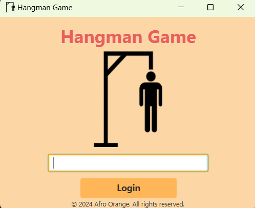
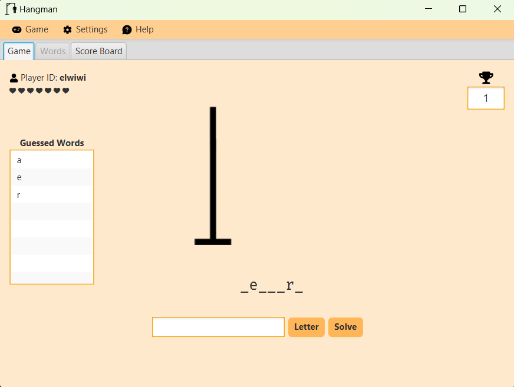

# Hangman Game

This is a Hangman game implemented in Java using JavaFX for the graphical user interface. The project is managed using Maven.

## Table of Contents

- [Installation](#installation)
- [Usage](#usage)
- [Project Structure](#project-structure)
- [Features](#features)
- [Contributing](#contributing)
- [License](#license)

## Installation

1. **Clone the repository:**
   ```sh
   git clone https://github.com/AfroOrange/hangman-game.git
   cd hangman-game

1- Build the project using Maven: 
    ```sh mvn clean install```

2- Run the application:
    ``` mvn javafx:run ```

## Usage

**Login**: Enter your name and click on the "_Login_" button to start the game.



**Start a new game**: Press F2 or click on the "New Game" button.



**Stop the game**: Click on the "Stop Game" button to end the current game and reveal the hidden word.

**Adjust volume**: Use the volume slider to adjust the background music volume.

**Get help**: Click on the "Help" button to open the help window.


## Features

**Game Controller**: Manages the game logic and user interactions.

**Score Board**: Displays the scores of different users.

**Words Controller**: Manages the words used in the game.

**Background Music**: Plays background music during the game.

**Help Window**: Provides help and instructions for the game.